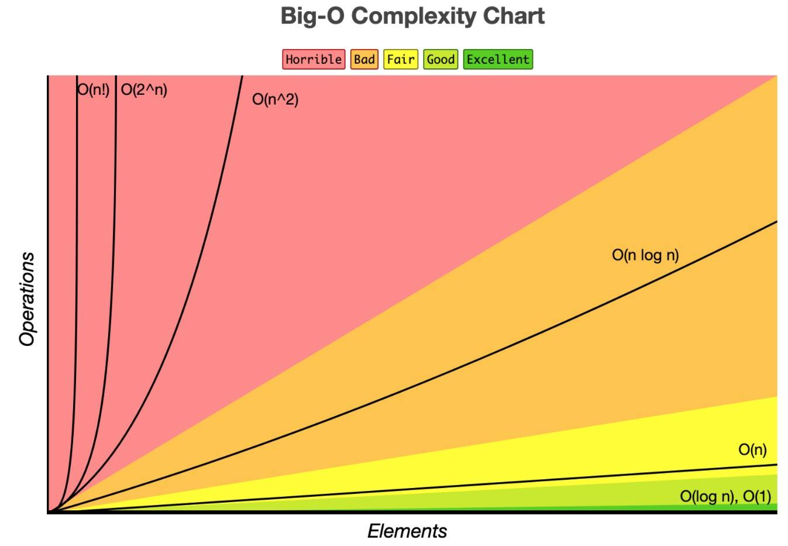

# Big O notation



- Big O notation is a mathematical notation that describes the limiting behavior of a function when the argument tends towards a particular value or infinity.

- It is used to describe how the runtime of an algorithm grows as the input size grows.

- Certain algorithms are more efficient than others, and Big O notation is a way to compare them.

### O(1) - Constant time complexity

```javascript
function printStuff {console.log(array[0])}
```

- the size of the input does not affect the runtime of the algorithm
- If we dubplicate the size of the input, the runtime of the algorithm will not change.
- It's still O(1) and not O(2) even though the input size has doubled.

```javascript
function printStuff {
  console.log(array[0])
  console.log(array[0])
}
```

### O(n) - Linear time complexity

```javascript
function printStuff {
  for (let i = 0; i < array.length; i++) {
    console.log(array[i])
  }
}
```

- The runtime of the algorithm grows linearly with the size of the input.
- If we double the size of the input, the runtime of the algorithm will also double.

```javascript
function printStuff {
  for (let i = 0; i < array.length; i++) {
    console.log(array[i])
  }
  for (let i = 0; i < array.length; i++) {
    console.log(array[i])
  }
}
```

- even if we ran two loops, it would still be O(n) and not O(2n), because we are only concerned with the highest order term.

```javascript
function printStuff {
  for (let i = 0; i < array.length; i++) {
    console.log(array[i])
  }
  for (let j = 0; j < array.length; i++) {
    console.log(array[i])
}}
```

- If we have two loops that are not nested, the runtime of the algorithm is O(n + n) which simplifies to O(2n). However, we only care about the highest order term, so the runtime is O(n).

### O(n^2) - Quadratic time complexity

```javascript
function printStuff { // O(n^2)
  for (let i = 0; i < array.length; i++) { // O(n)
    for (let j = 0; j < array.length; j++) { // O(n)
      console.log(array[i] + array[j])
    }
  }
}
```
- The runtime of the algorithm grows quadratically with the size of the input.
- If we double the size of the input, the runtime of the algorithm will increase by a factor of 4.
- so it's slower than O(n) and O(1)
- you will not see much differance in an array of 50 elements, but you will see a huge differance in an array of 1000 elements.


### O(log n) - Logarithmic time complexity
- is more scalable than O(n) and O(n^2)


### O(2^n) - Exponential time complexity
- is the slowest of all the time complexities
- it's not scalable at all

### space complexity
- how much memory is used by the algorithm
- sometimes we have to make a trade-off between time and space complexity
- sometimes we can optimize the space complexity by using a different data structure
- sometimes we can optimize the time complexity by using a different data structure
